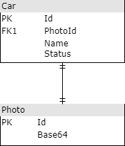

# Avaliação Back-end
Olá desenvolvedor!\
Tudo bem?! 😊\
\
Seja bem-vindo, o intuito do teste não é reprovar e sim conhecer seu melhor estilo de programar e resolver problemas.

## O que fazer
1. Disponibilizaremos uma máquina windows para hospedar a API([Web App](https://docs.microsoft.com/pt-br/aspnet/core/web-api/?WT.mc_id=dotnet-35129-website&view=aspnetcore-6.0)) e enviaremos o [perfil de publicação](https://docs.microsoft.com/pt-br/visualstudio/deployment/quickstart-deploy-aspnet-web-app?view=vs-2022&tabs=import-profile) para o desenvolvimento da API. Também será disponibilizado um banco de dados [Azure SQL Server](https://docs.microsoft.com/pt-br/azure/azure-sql/azure-sql-iaas-vs-paas-what-is-overview?view=azuresql) com seu usuário e senha para o desenvolvimento do banco.
2. Crie um repositório no GitHub para a API.
3. Use esse repositório para desenvolver a API.
4. Com o banco de dados SQL Server enviado pela Ímpar, criar a estrutura a partir da seguinte UML:\

5. Fazer um endpoint para criar um carro.
6. Fazer um endpoint para editar um carro.
7. Fazer um endpoint para excluir um carro.
8. Fazer um endpoint para consultar os carros.\
8.1 Criar um sistema de busca de itens pela coluna "Name" ou usar o OData para isso.\ 
8.2 Criar um sistema de paginação de itens ou usar o OData para isso.\
8.3 O retorno do endpoint deverá ser uma array do seguinte JSON:
  ```yaml
  {
     "Id": 0,
     "Name": "Some Name",
     "Status": "Some Status"
     "PhotoId": 0
  }
  ```
9. Criar um endpoint que renderiza a foto de um item específico.
10. A API deve ser construída em .NET 5/6
11. Documentar a API com o [Swagger](https://docs.microsoft.com/en-us/aspnet/core/tutorials/web-api-help-pages-using-swagger?view=aspnetcore-6.0)
12. Publicar essa API na máquina disponibilizada pela Ímpar com o perfil de publicação.

## Ao finalizar o código
1. Publicar a API na máquina disponibilizada através do perfil de publicação.
2. Enviar um e-mail para processoseletivo@impar.com.br com o assunto "Avaliação Back-end", informando que finalizou a avaliação e colocando o link do seu repositório GitHub com o código feito da API. 

## Dicas
* Gostamos das camadas bem definidas no Back-end, o mínimo do DDD.

## Quais tecnologias usar
* A API deverá ser construída em .Net 5/6.

## Desafios se você se sentir confiante
* Utilizar [OData](https://docs.microsoft.com/en-us/odata/overview) na API.
